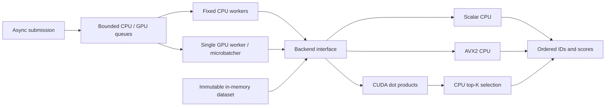

# Flowstate

Flowstate is a C++20 exact dot-product vector search project, being built toward
an adaptive CPU/CUDA runtime. It implements deterministic datasets, scalar and
AVX2 search, CUDA search, a bounded concurrent runtime, GPU microbatching,
correctness tests, and reproducible benchmarks.

**Phase 1 is complete.** Scalar, AVX2, and CUDA pass correctness tests on an
i9-12900H / RTX 3080 Ti Laptop GPU under WSL 2. A measured crossover favors AVX2
for a small single query and CUDA for batches of the same workload. **Phase 2 is
complete:** concurrent submission, shutdown, and GPU batching are validated;
batching improves throughput in both measured burst workloads.
See [progress](PROGRESS.md), [results](docs/RESULTS.md), and the
[source specification](agents/FLOWSTATE_CODEX_LEAN_SPEC.md).



## Build and test

Requires CMake 3.24+ and a C++20 GCC or Clang compiler. The GPU build was validated
with Ubuntu 24.04 / WSL 2, GCC 13.3, CMake 3.28.3, and CUDA 13.2.86.

```sh
cmake -S . -B build -DCMAKE_BUILD_TYPE=Release
cmake --build build -j
ctest --test-dir build --output-on-failure
```

CUDA is optional. To enable it, use an NVIDIA GPU, an installed driver, and an
`nvcc` toolchain supporting C++20 with a compatible host compiler:

```sh
cmake -S . -B build-gpu -DCMAKE_BUILD_TYPE=Release -DFLOWSTATE_ENABLE_CUDA=ON
cmake --build build-gpu -j
ctest --test-dir build-gpu --output-on-failure
# These must succeed, without skips, before claiming backend equivalence:
./build-gpu/flowstate_tests avx2
./build-gpu/flowstate_tests cuda
```

Explicit CUDA configuration fails clearly when the toolkit is missing. CPU-only
builds work on ARM. CTest reports unavailable backend execution as **skipped**;
a skipped test does not establish correctness. Only the AVX2 dot-product function
is compiled for AVX2, and its factory checks runtime CPU/OS support before use.

CPU sanitizer builds accept `address`, `undefined`, or `thread`:

```sh
cmake -S . -B build-ubsan -DCMAKE_BUILD_TYPE=Debug -DFLOWSTATE_SANITIZER=undefined
cmake --build build-ubsan -j
ctest --test-dir build-ubsan --output-on-failure
```

Linux ThreadSanitizer checks cover the runtime's concurrency paths. The current
macOS host's AddressSanitizer runtime stalls before `main()`;
Linux ASan and UBSan checks pass, including AVX2. See
[validation limitations](docs/RESULTS.md) for the WDDM Compute Sanitizer limitation.

## Run a search

```sh
./build/flowstate_search --vectors 100000 --dimension 384 --top-k 10 --seed 42
./build/flowstate_search --backend scalar --dimension 129
./build-gpu/flowstate_search --backend cuda
```

`auto` selects AVX2 when available, otherwise scalar. An explicitly requested
unavailable backend fails. Defaults are 100,000 vectors, dimension 384, float32,
top-K 10, seed 42. Values are deterministic in `[-1, 1)` and queries use a
separate deterministic seed. Results are sorted by descending score, with exact
ties ordered by ascending vector ID. Invalid shapes, top-K, and non-finite
inputs are rejected; a non-finite dot product raises an overflow error.

## Benchmark

```sh
./build/flowstate_bench --backend all --vectors 100000 --dimension 384 \
  --batch-size 1 --warmup 5 --iterations 50 --label 'describe host here'

# Python standard library only; records dimensions 128/384/768 and batches 1/8/32.
python3 benchmarks/run_matrix.py --binary build-gpu/flowstate_bench \
  --require-all --label 'native x86-64 + NVIDIA GPU' \
  --output benchmark-output/gpu
```

The benchmark warms up before measurement and emits CSV with average/p50/p95/p99
batch latency, queries/sec, and CUDA upload/kernel/download event timings.
For batch size 1, batch latency is single-query latency. Larger batches measure
the time until **all results** are ready, including host top-K; their latency is
not divided by the number of queries. Dataset creation/upload is setup time and
excluded. The CPU batch path executes queries serially with one calling thread.

The matrix runner saves compiler commands/flags, host information, GPU/driver and
CUDA versions when available, input parameters, and Git state alongside CSV.
`--require-all` fails if either AVX2 or CUDA is unavailable. Raw artifacts are
ignored by Git. [Recorded results](docs/RESULTS.md) include all 45 measured
CPU/GPU cases plus the original ARM baseline. At 1,000 × 384, K=10, AVX2 wins
for one query (0.028 ms vs CUDA 0.123 ms), while CUDA wins at batch size 8
(0.166 ms vs AVX2 0.241 ms). At 100,000 × 384, CUDA batch 32 reaches about
**1,206 queries/sec**; AVX2 reaches about **133 queries/sec**.

## Concurrent runtime

```cpp
#include "flowstate/runtime.hpp"

auto dataset = flowstate::Dataset::generate(100000, 384, 42);
flowstate::RuntimeConfig config;
config.enable_cuda = true; // Omit for a CPU-only runtime.
flowstate::Runtime runtime(dataset, config);
flowstate::Query query{std::vector<float>(384, 0.25f), 10};
auto future = runtime.submit(std::move(query), flowstate::Route::GpuBatch);
auto completion = future.get(); // IDs/scores, request ID, backend, batch size, timing.
runtime.shutdown();             // Drain accepted work and join every worker.
```

The default route is CPU (AVX2 when available, otherwise scalar). Explicit GPU
routes either execute immediately or collect up to 32 queries, with a 2 ms
oldest-request timeout. Two fixed CPU workers and one GPU worker share a total
capacity of 1,024 waiting requests; in-flight work is separately bounded.
`submit` validates inputs and throws `QueueFull` or `RuntimeStopped` on rejection.
Backend failures propagate through the affected futures. Shutdown is idempotent;
the destructor also drains pending work. GPU routes require an enabled backend.

```sh
./build-gpu/flowstate_runtime_bench --backend all --require-all \
  --vectors 100000 --dimension 384 --workers 2 --requests 512 \
  --batch-size 32 --max-wait-us 2000 --iterations 10 --warmup 3
```

This benchmark compares CPU workers, immediate GPU execution, and runtime GPU
batching using repeated bursts. CSV includes throughput, request p50/p95/p99,
queue wait, observed batch size, flush counts, and kernel time per batch.
Requests must fit the configured queue capacity for this burst benchmark.

## Remaining phases

The remaining phases add rolling telemetry, heuristic scheduling, Jev, and a
lightweight browser dashboard. The native **data plane** owns all request
execution. Jev will be a periodic
**control plane** policy selector, outside the request hot path, with heuristic
fallback. Adaptive policy selection and the dashboard are not implemented yet.

Current technical concerns are floating-point reduction differences, safe SIMD
dispatch, GPU resource lifetime, and measuring total result latency alongside
kernel cost. [Architecture](docs/ARCHITECTURE.md) describes the current design.

Demo video/GIF: pending completion of the runtime and dashboard phases.
