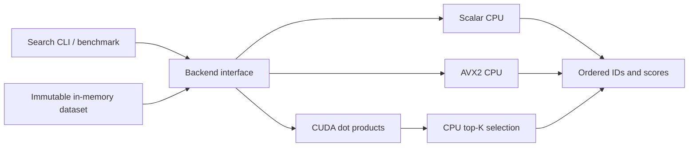

# Flowstate

Flowstate is a C++20 exact dot-product vector search project, being built toward
an adaptive CPU/CUDA runtime. The current implementation is the Phase 1 compute
core: deterministic datasets, scalar and AVX2 search, a CUDA implementation,
correctness tests, and reproducible benchmarks.

**Phase 1 is not complete.** Scalar execution is validated on ARM macOS. AVX2
cross-compiles but needs execution on supported hardware. CUDA needs compilation,
correctness validation, and a measured CPU/GPU crossover on an NVIDIA host.
See [progress](PROGRESS.md), [results](docs/RESULTS.md), and the
[source specification](agents/FLOWSTATE_CODEX_LEAN_SPEC.md).



## Build and test

Requires CMake 3.24+ and a C++20 GCC or Clang compiler.

```sh
cmake -S . -B build -DCMAKE_BUILD_TYPE=Release
cmake --build build -j
ctest --test-dir build --output-on-failure
```

CUDA is optional. To enable it, use an NVIDIA GPU, an installed driver, and an
`nvcc` toolchain supporting C++20 with a compatible host compiler:

```sh
cmake -S . -B build-gpu -DCMAKE_BUILD_TYPE=Release -DFLOWSTATE_ENABLE_CUDA=ON
cmake --build build-gpu -j
ctest --test-dir build-gpu --output-on-failure
# These must succeed, without skips, before claiming backend equivalence:
./build-gpu/flowstate_tests avx2
./build-gpu/flowstate_tests cuda
```

Explicit CUDA configuration fails clearly when the toolkit is missing. CPU-only
builds work on ARM. CTest reports unavailable backend execution as **skipped**;
a skipped test does not establish correctness. Only the AVX2 dot-product function
is compiled for AVX2, and its factory checks runtime CPU/OS support before use.

CPU sanitizer builds accept `address`, `undefined`, or `thread`:

```sh
cmake -S . -B build-ubsan -DCMAKE_BUILD_TYPE=Debug -DFLOWSTATE_SANITIZER=undefined
cmake --build build-ubsan -j
ctest --test-dir build-ubsan --output-on-failure
```

ThreadSanitizer support is configured for later concurrency work. No worker pool
exists yet. The current host's AddressSanitizer runtime stalls before `main()`;
see [validation limitations](docs/RESULTS.md).

## Run a search

```sh
./build/flowstate_search --vectors 100000 --dimension 384 --top-k 10 --seed 42
./build/flowstate_search --backend scalar --dimension 129
./build-gpu/flowstate_search --backend cuda
```

`auto` selects AVX2 when available, otherwise scalar. An explicitly requested
unavailable backend fails. Defaults are 100,000 vectors, dimension 384, float32,
top-K 10, seed 42. Values are deterministic in `[-1, 1)` and queries use a
separate deterministic seed. Results are sorted by descending score, with exact
ties ordered by ascending vector ID. Invalid shapes, top-K, and non-finite
inputs are rejected; a non-finite dot product raises an overflow error.

## Benchmark

```sh
./build/flowstate_bench --backend all --vectors 100000 --dimension 384 \
  --batch-size 1 --warmup 5 --iterations 50 --label 'describe host here'

# Python standard library only; records dimensions 128/384/768 and batches 1/8/32.
python3 benchmarks/run_matrix.py --binary build-gpu/flowstate_bench \
  --require-all --label 'native x86-64 + NVIDIA GPU' \
  --output benchmark-output/gpu
```

The benchmark warms up before measurement and emits CSV with average/p50/p95/p99
batch latency, queries/sec, and CUDA upload/kernel/download event timings.
For batch size 1, batch latency is single-query latency. Larger batches measure
the time until **all results** are ready, including host top-K; their latency is
not divided by the number of queries. Dataset creation/upload is setup time and
excluded. The CPU batch path executes queries serially with one calling thread.

The matrix runner saves compiler commands/flags, host information, GPU/driver and
CUDA versions when available, input parameters, and Git state alongside CSV.
`--require-all` fails if either AVX2 or CUDA is unavailable. Raw artifacts are
ignored by Git. [Recorded results](docs/RESULTS.md) currently contain only the
native ARM scalar baseline: about **53 queries/sec** at 100,000 × 384, K=10.

## Runtime direction

The remaining phases add bounded queues and worker threads, GPU microbatching,
telemetry, heuristic scheduling, Jev, and a lightweight browser dashboard.
The native **data plane** will own all request execution. Jev will be a periodic
**control plane** policy selector, outside the request hot path, with heuristic
fallback. These runtime and dashboard features are not implemented yet.

Current technical concerns are floating-point reduction differences, safe SIMD
dispatch, GPU resource lifetime, and measuring total result latency alongside
kernel cost. [Architecture](docs/ARCHITECTURE.md) describes the current design.

Demo video/GIF: pending completion of the runtime and dashboard phases.
