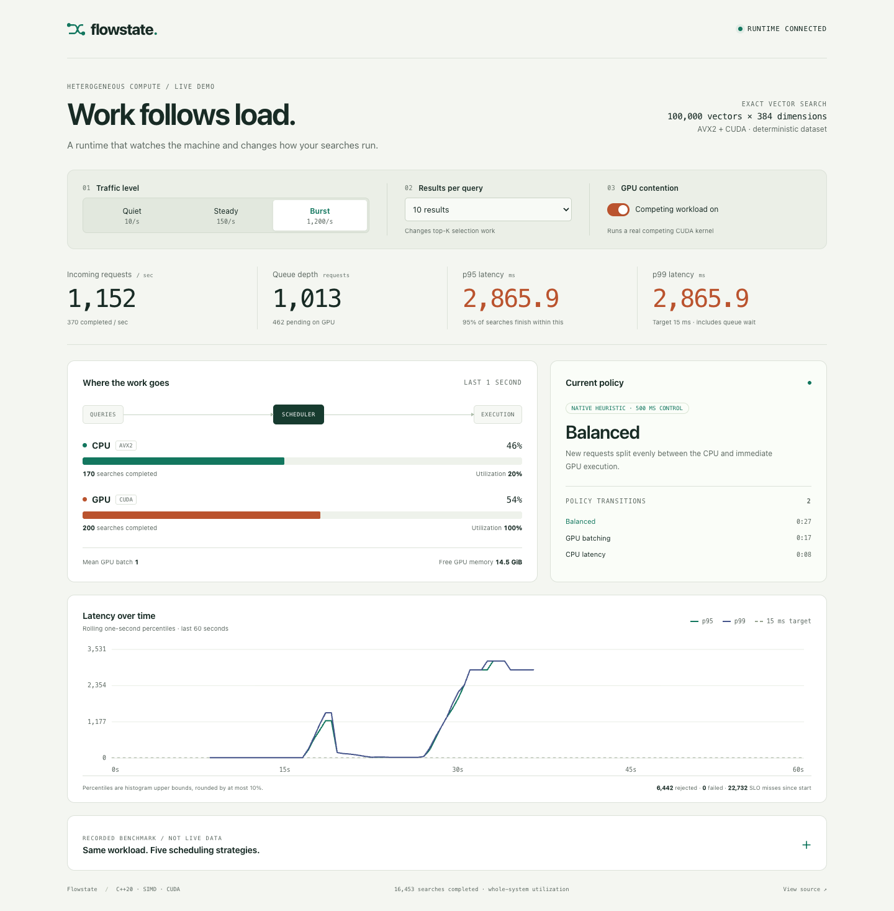
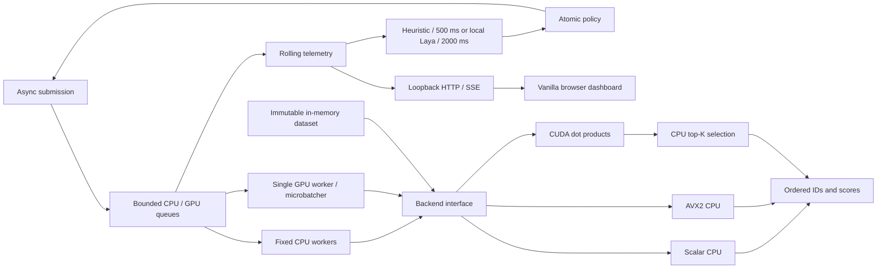

# Flowstate

Flowstate is an adaptive C++20/CUDA runtime for exact dot-product vector search.
It combines scalar and AVX2 search, CUDA microbatching, bounded concurrency,
rolling telemetry, native heuristic scheduling, and an optional local Laya policy
controller. A realtime browser dashboard exposes the runtime and a small set of
workload controls.

All five phases are implemented and validated on an i9-12900H / RTX 3080 Ti Laptop
under WSL 2. The measurements favor static GPU batching on the recorded trace;
Laya adds inference overhead and remains experimental. See
[results](docs/RESULTS.md), [architecture](docs/ARCHITECTURE.md),
[progress](PROGRESS.md), and the [source specification](agents/FLOWSTATE_CODEX_LEAN_SPEC.md).





## Build and test

Requires CMake 3.24+ and a C++20 GCC or Clang compiler. The GPU build was validated
with Ubuntu 24.04 / WSL 2, GCC 13.3, CMake 3.28.3, and CUDA 13.2.86.

```sh
cmake -S . -B build -DCMAKE_BUILD_TYPE=Release
cmake --build build -j
ctest --test-dir build --output-on-failure
```

CUDA is optional. To enable it, use an NVIDIA GPU, an installed driver, and an
`nvcc` toolchain supporting C++20 with a compatible host compiler:

```sh
cmake -S . -B build-gpu -DCMAKE_BUILD_TYPE=Release -DFLOWSTATE_ENABLE_CUDA=ON
cmake --build build-gpu -j
ctest --test-dir build-gpu --output-on-failure
# These must succeed, without skips, before claiming backend equivalence:
./build-gpu/flowstate_tests avx2
./build-gpu/flowstate_tests cuda
```

Explicit CUDA configuration fails clearly when the toolkit is missing. CPU-only
builds work on ARM. CTest reports unavailable backend execution as **skipped**;
a skipped test does not establish correctness. Only the AVX2 dot-product function
is compiled for AVX2, and its factory checks runtime CPU/OS support before use.

CPU sanitizer builds accept `address`, `undefined`, or `thread`:

```sh
cmake -S . -B build-ubsan -DCMAKE_BUILD_TYPE=Debug -DFLOWSTATE_SANITIZER=undefined
cmake --build build-ubsan -j
ctest --test-dir build-ubsan --output-on-failure
```

Linux ThreadSanitizer checks cover the runtime's concurrency paths. The current
macOS host's AddressSanitizer runtime stalls before `main()`;
Linux ASan and UBSan checks pass, including AVX2. See
[validation limitations](docs/RESULTS.md) for the WDDM Compute Sanitizer limitation.

## Run a search

```sh
./build/flowstate_search --vectors 100000 --dimension 384 --top-k 10 --seed 42
./build/flowstate_search --backend scalar --dimension 129
./build-gpu/flowstate_search --backend cuda
```

`auto` selects AVX2 when available, otherwise scalar. An explicitly requested
unavailable backend fails. Defaults are 100,000 vectors, dimension 384, float32,
top-K 10, seed 42. Values are deterministic in `[-1, 1)` and queries use a
separate deterministic seed. Results are sorted by descending score, with exact
ties ordered by ascending vector ID. Invalid shapes, top-K, and non-finite
inputs are rejected; a non-finite dot product raises an overflow error.

## Benchmark

```sh
./build/flowstate_bench --backend all --vectors 100000 --dimension 384 \
  --batch-size 1 --warmup 5 --iterations 50 --label 'describe host here'

# Python standard library only; records dimensions 128/384/768 and batches 1/8/32.
python3 benchmarks/run_matrix.py --binary build-gpu/flowstate_bench \
  --require-all --label 'native x86-64 + NVIDIA GPU' \
  --output benchmark-output/gpu
```

The benchmark warms up before measurement and emits CSV with average/p50/p95/p99
batch latency, queries/sec, and CUDA upload/kernel/download event timings.
For batch size 1, batch latency is single-query latency. Larger batches measure
the time until **all results** are ready, including host top-K; their latency is
not divided by the number of queries. Dataset creation/upload is setup time and
excluded. The CPU batch path executes queries serially with one calling thread.

The matrix runner saves compiler commands/flags, host information, GPU/driver and
CUDA versions when available, input parameters, and Git state alongside CSV.
`--require-all` fails if either AVX2 or CUDA is unavailable. Raw artifacts are
ignored by Git. [Recorded results](docs/RESULTS.md) include all 45 measured
CPU/GPU cases plus the original ARM baseline. At 1,000 × 384, K=10, AVX2 wins
for one query (0.028 ms vs CUDA 0.123 ms), while CUDA wins at batch size 8
(0.166 ms vs AVX2 0.241 ms). At 100,000 × 384, CUDA batch 32 reaches about
**1,206 queries/sec**; AVX2 reaches about **133 queries/sec**.

## Concurrent runtime

```cpp
#include "flowstate/runtime.hpp"

auto dataset = flowstate::Dataset::generate(100000, 384, 42);
flowstate::RuntimeConfig config;
config.enable_cuda = true; // Omit for a CPU-only runtime.
flowstate::Runtime runtime(dataset, config);
flowstate::Query query{std::vector<float>(384, 0.25f), 10};
auto future = runtime.submit(std::move(query), flowstate::Route::GpuBatch);
auto completion = future.get(); // IDs/scores, request ID, backend, batch size, timing.
runtime.shutdown();             // Drain accepted work and join every worker.
```

The default route is CPU (AVX2 when available, otherwise scalar). Explicit GPU
routes either execute immediately or collect up to 32 queries, with a 2 ms
oldest-request timeout. Two fixed CPU workers and one GPU worker share a total
capacity of 1,024 waiting requests; in-flight work is separately bounded.
`submit` validates inputs and throws `QueueFull` or `RuntimeStopped` on rejection.
Backend failures propagate through the affected futures. Shutdown is idempotent;
the destructor also drains pending work. GPU routes require an enabled backend.

```sh
./build-gpu/flowstate_runtime_bench --backend all --require-all \
  --vectors 100000 --dimension 384 --workers 2 --requests 512 \
  --batch-size 32 --max-wait-us 2000 --iterations 10 --warmup 3
```

This benchmark compares CPU workers, immediate GPU execution, and runtime GPU
batching using repeated bursts. CSV includes throughput, request p50/p95/p99,
queue wait, observed batch size, flush counts, and kernel time per batch.
Requests must fit the configured queue capacity for this burst benchmark.

## Adaptive scheduling and traffic traces

`HeuristicController` samples every 500 ms (configurable up to 2 seconds) and
sets one of four policies. `submit(query)` uses that choice; the explicit route
overload remains available for benchmarks. Construct the controller after the
runtime and destroy/stop it before destroying the runtime.

```cpp
#include "flowstate/scheduler.hpp"
flowstate::HeuristicController controller(runtime);
auto future = runtime.submit(query);
// ...
controller.stop();
runtime.shutdown();
```

Policies select CPU, immediate GPU, GPU batching, or a deterministic 50/50 split
between CPU and immediate GPU. Queued and in-flight jobs keep their original
routes. Central `HeuristicConfig` thresholds consider offered traffic, queue
pressure, and available system readings. Without a GPU, the controller stays on
CPU. Missing utilization does not prevent decisions from measured traffic/queues.

```sh
python3 benchmarks/run_load.py --binary build-gpu/flowstate_load \
  --cuda on --cpu-backend avx2 --trace benchmarks/traces/adaptive.csv \
  --output benchmark-output/adaptive

# Portable CPU-only comparison:
python3 benchmarks/run_load.py --cuda off --modes cpu_latency heuristic \
  --vectors 1000 --output benchmark-output/cpu-load
```

Trace CSV specifies phase name, duration, average offered requests/sec, burst
size, and top-K. Dimension and dataset size are configurable per run; top-K
varies real selection work within a trace. Queries and arrival schedules use the
same seed/trace across policies. The default 20-second trace moves from 10 QPS to
1,200 QPS in bursts of 32, then 150 QPS with K=50, and returns to 10 QPS.

The runner saves configuration, trace contents/hash, compiler and hardware
metadata, per-mode summary CSV, and telemetry every 500 ms. Summary percentiles
are exact nearest-rank samples. It records producer lateness separately and
includes that lateness in offered p99 and SLO violations; rejected/failed queries
also count as violations. Throughput includes the final drain. Use `flowstate_load --help` for rate thresholds and runtime configuration. Traces are bounded to one
hour and two million requests for measurement storage.

Runtime telemetry covers rolling 1/5/30-second rates and latency distributions.
Its bounded histograms report percentile upper bounds with at most 10% rounding
and a 1 microsecond floor; window boundaries have 100 ms resolution. These are
separate from the benchmark's exact percentiles. CPU utilization reads Linux
`/proc/stat`; CUDA builds use optional NVML for GPU utilization and free memory.
Install NVML headers and the driver library to enable those readings. Unsupported
readings and backend percentiles with no samples remain absent (empty CSV cells).
macOS CPU utilization is currently unavailable. System utilization includes other
processes and is distinct from runtime worker occupancy.

## Local Laya control plane

The optional `LayaPolicyController` calls a local CPU inference process once every
2 seconds. [Laya](https://github.com/NandhaKishorM/laya) replaces the originally
planned hosted Jev controller by user request. Its existing FastAPI/uvicorn server
handles inference; Flowstate remains a C++/CUDA vector-search runtime. Only
aggregate telemetry and four policy descriptions cross the loopback connection.

```sh
# Ubuntu prerequisite: sudo apt-get install libcurl4-openssl-dev python3-venv
cmake -S . -B build-laya -DCMAKE_BUILD_TYPE=Release -DFLOWSTATE_ENABLE_LAYA=ON
cmake --build build-laya -j
ctest --test-dir build-laya --output-on-failure

python3 -m venv .venv-laya
.venv-laya/bin/python -m pip install 'torch==2.14.0' --index-url https://download.pytorch.org/whl/cpu
.venv-laya/bin/python -m pip install -r tools/laya-requirements.txt
build-laya/flowstate_laya_tests --sample-request > /tmp/flowstate-laya-request.json
.venv-laya/bin/python tools/run_laya.py --threads 4 --warmup-request /tmp/flowstate-laya-request.json
```

These inference setup commands target Linux/WSL; native C++ CPU builds also work
on macOS. The launcher pins Laya 0.3.20's English checkpoint to revision
`55cf4c4ebb4ebe31b2550e8bdf3bd21b99753851`, binds only `127.0.0.1:8000`, and limits
inference to four CPU threads plus one inter-op thread. The first launch downloads
weights into ignored `.cache-laya/`; subsequent launches reuse them. No TypeSafe
account or API key is needed. Keep this process running during the comparison.
It uses upstream serving code; the small launcher only configures the checkpoint,
resource limits, warmup, and a hook that rejects inputs exceeding token budgets.
Model weights, virtual environments, and caches are never committed.

Enable both `FLOWSTATE_ENABLE_LAYA=ON` and `FLOWSTATE_ENABLE_CUDA=ON` for CUDA runs.
CMake fetches nlohmann/json 3.12.0 with a pinned SHA256 and requires libcurl 7.85+.
The default CPU-only build has no Laya dependency.

```sh
python3 benchmarks/run_load.py --binary build-gpu/flowstate_load \
  --cuda on --cpu-backend avx2 --interval-ms 2000 \
  --modes cpu_latency gpu_immediate gpu_batch heuristic laya \
  --output benchmark-output/laya-comparison
```

Calls have an 800 ms timeout, bounded request/response bodies, no redirects or
proxy use, and no immediate retries. Timeouts, unavailable service, malformed
answers, and low confidence select the heuristic. GPU unavailability skips model
calls. The last applied policy stays active while waiting; search submissions and
execution never wait for inference. Shutdown joins the control thread.

Laya's `answer_confidence` (maximum class probability) is checked against its
returned distribution and an initial 0.70 gate. Its entropy-based `confidence`
field is deliberately ignored. Neither score is calibrated for Flowstate: upstream
reports overconfidence and weak zero-shot results on its typed-decision tasks.
This is an experimental policy selector, with no claim of superiority over native
scheduling. No training pipeline is included. [Upstream limitations](https://github.com/NandhaKishorM/laya#honest-limits).

CSV output records decisions, confidence, fallbacks, errors, and control latency.
`--laya-port`, `--laya-timeout-ms`, `--laya-min-confidence`, `--interval-ms`, and
`--slo-ms` are configurable. Evaluation includes local inference's CPU cost;
fixture tests are not model performance measurements. On the measured trace, all
default-gated calls fell back; ungated Laya chose GPU batching throughout and
performed similarly to static batching. The heuristic is the practical default.
See the full [results](docs/RESULTS.md).

## Launch the dashboard

The dashboard is optional and uses pinned cpp-httplib 0.57.1 and nlohmann/json
3.12.0 dependencies. There is no frontend build step or Node dependency at runtime.
The default compute-only build fetches neither package.

```sh
# CUDA demo; Laya can be enabled separately with -DFLOWSTATE_ENABLE_LAYA=ON.
cmake -S . -B build-demo -DCMAKE_BUILD_TYPE=Release \
  -DFLOWSTATE_ENABLE_CUDA=ON -DFLOWSTATE_ENABLE_DASHBOARD=ON
cmake --build build-demo -j
ctest --test-dir build-demo --output-on-failure
./build-demo/flowstate_server --cuda on
# Open http://127.0.0.1:8080
```

For a CPU-only preview, omit the CUDA CMake option and run with `--cuda off`.
GPU controls and unavailable telemetry are disabled/marked unavailable. The server
accepts `--vectors`, `--dimension`, `--top-k`, `--seed`, and `--port`; use `--help`
for the short list. It warms the backends before listening. Keep the source tree
available: web assets and the recorded comparison are loaded from their compiled
source paths at startup. Restart the server after editing those files.

The server binds only loopback. When it runs on another computer, forward the port
with `ssh -N -L 18080:127.0.0.1:8080 USER@HOST` and open
`http://127.0.0.1:18080`. WSL's Windows localhost forwarding was validated on the
Razer. Stop with Ctrl-C; accepted search work drains before shutdown.

To show Laya, enable `FLOWSTATE_ENABLE_LAYA`, start the local model service as
above, then launch `flowstate_server --cuda on --controller laya`. The UI shows
its last probability, call latency, fallback state, and counts. The native
heuristic is the default controller for the short demo.

### A 50-second demo

1. **0–10 seconds:** leave traffic at Quiet. Explain that routing follows live
   machine conditions; sparse queries normally use AVX2.
2. **10–20 seconds:** select Burst. Watch queue pressure, the policy transition,
   and completions shift toward GPU batches.
3. **20–30 seconds:** enable GPU contention. A real competing CUDA kernel runs
   in a separate stream. When measured utilization crosses the heuristic threshold,
   new requests split between CPU and GPU.
4. **30–40 seconds:** disable contention and select Quiet. Let the queue drain
   and watch the CPU policy return.
5. **40–50 seconds:** open the recorded comparison. Explain why static GPU
   batching won this trace and why the local model is experimental.

Traffic controls are best-effort targets of 10, 150, and 1,200 requests/sec;
Incoming requests shows the measured rate. Results per query changes real top-K
selection work without rebuilding the dataset. CPU/GPU bars show successful
completions in the last second, while utilization covers the whole machine.
Latency includes queue wait and uses the runtime's bounded histograms. Overload
rejections and SLO misses remain visible. The comparison is explicitly labeled
recorded data and never changes with the live controls.

Actual transition times and utilization depend on hardware and background work;
the dashboard does not synthesize measurements to match a script. The Razer demo
observed CPU → GPU batching → balanced → GPU batching → CPU, including a brief
batching transition while draining after contention. Browser disconnects do not
stop the runtime. Controls disable while disconnected and reconnect automatically.

Demo video/GIF: **placeholder** — the screenshot above is from the validated live
GPU demo; follow the sequence above to record it.

### Browser regression checks

CTest covers HTTP/SSE, malformed controls, bounded client connections, GPU
contention (CUDA build), and shutdown under load. An optional Chrome check also
covers responsive layout, controls, custom startup top-K, cached-page lifecycle
handlers, server restart, and recovery from the stream limit:

```sh
npm install --prefix /tmp/flowstate-browser --no-save playwright-core@1.63.0
NODE_PATH=/tmp/flowstate-browser/node_modules \
  node tests/browser_tests.cjs build-demo/flowstate_server
```

This check uses an installed Google Chrome and starts/stops its own CPU-only
server. It does not require the demo or inference service to be running.

## Technical challenges and limits

- Equivalent ranked results across scalar, SIMD, and CUDA reductions, including
  scalar tails and floating-point ties.
- Bounded admission, promise ownership, timed batch flushes, and orderly shutdown
  while work and telemetry readers are active.
- Keeping network/model work on a slow control thread while native workers execute
  independently; validating responses and falling back on every failure path.
- Measuring queueing and overload honestly. Adaptive routing can create CPU
  backlogs; a policy change does not move work that is already queued.
- Separating browser connection lifetime from runtime lifetime. SSE clients and
  HTTP queues are bounded; slow or disconnected viewers do not own search jobs.

GPU top-K remains on the CPU, transfers use pageable host memory, and the runtime
uses one GPU worker/stream. These are documented implementation limits, not claims
of an optimized vector database. Benchmark setup, sanitizer limitations, and the
independent review findings are recorded in [results](docs/RESULTS.md).
