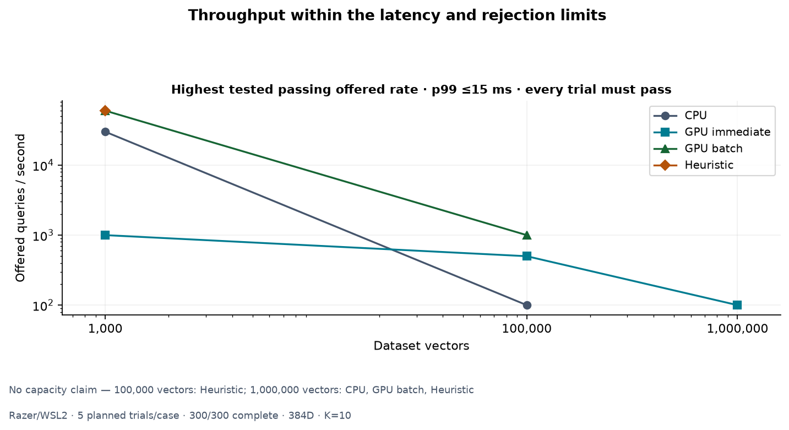
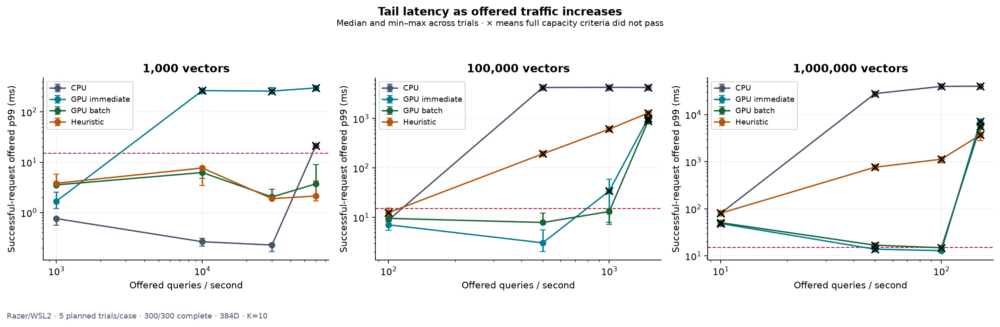
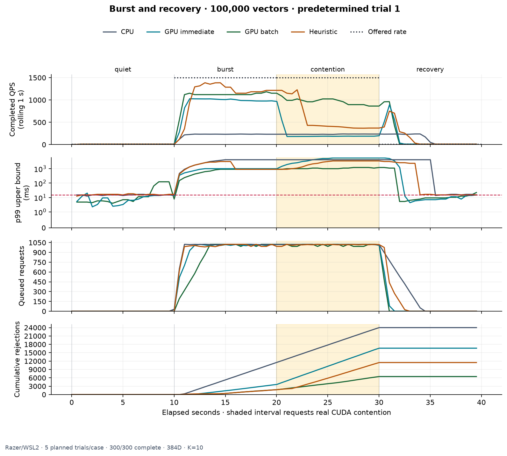

# Repeated benchmark report

Razer/WSL2 · started 2026-09-28T23:46:28.289713+00:00

Completed **300 / 300 trials**. Source commit: `a34f62f299f18329ff911083bcae5ed64e33dd6a`.

CPU: 12th Gen Intel(R) Core(TM) i9-12900H

CPU search backend(s): avx2

GPU / driver / VRAM: NVIDIA GeForce RTX 3080 Ti Laptop GPU, 596.21, 16384 MiB

384 dimensions, float32, top-K 10, seed 42; 2 CPU workers, queue 1024, batches ≤32, wait ≤2000 µs; 5 independent process trials per case.

## Findings

This study offered **87,318,000 requests**, completed **60,169,059 searches**,
and recorded **27,148,941 overload rejections**, with **zero search or controller
errors**. All 60 dynamic trials executed real competing CUDA kernels. Each of
the 60 workload/policy cells has all five planned repetitions.

- At **100K vectors**, GPU batching passed **1,000 offered QPS** in every trial:
  p99 **7.97–14.84 ms**, with zero rejections.
- At **1M vectors**, GPU immediate passed **100 offered QPS** in every trial:
  p99 **12.30–14.72 ms**, with zero rejections.
- At **1K vectors**, GPU batching and the heuristic passed **60,000 offered QPS**,
  the highest tested rate. Their capacity limits were not reached by this grid.
- The heuristic had no passing tested rate at 100K or 1M vectors. GPU batching
  had no passing tested rate at 1M. These outcomes are retained alongside wins.

The table below reports a coarse tested grid, so ratios between its entries
must not be presented as ratios of true maximum capacity. At 100K / 1,000 QPS,
GPU-immediate p99 varied enough to fail some repetitions; a favorable single
trial would have overstated its result. Low-load latency was non-monotonic in
some cases; clock speeds and desktop activity were not controlled.

GCC **13.3.0**, CMake **3.28.3**, CUDA **13.2.86**, `sm_86`, Release.
See [configured compiler metadata](toolchain.json) and the
[complete compiler commands/flags](manifest.json). The binary hash at the end
of collection matched the starting manifest, and the source working tree was
still clean. All 15 CUDA Release tests passed before measurement.

Two incomplete trials were rerun after SSH interruptions: 161 and 279.
All completed records were preserved and verified before resuming with identical
source, binary, and configuration. The gaps between valid trials were 19.3 and
3.4 minutes; [individual timestamps](trials.csv) retain this history. The study
consists of independent short trials and includes these pauses.

## Method

Each repetition visits every case in a seeded shuffled order. Three batches warm each native backend before measurement; dataset creation and persistent GPU upload are excluded. The runtime/controller start with empty queues. The same 32 deterministic queries cycle through each trace.

Steady trials offer traffic for 30 seconds; elapsed time and throughput include final drain. Successful-request offered latency includes producer lateness, queueing, and execution. Rejections/failures also count as SLO violations. End-to-end summaries use exact nearest-rank quantiles.

Tables show medians across trials with full observed min–max ranges, not confidence intervals. No pooled p99 or maximum-capacity extrapolation is reported. Desktop activity, WSL scheduling, temperature and clock speeds are uncontrolled. These are finite-duration tests, not production guarantees.

## Highest tested rate meeting the criteria

Every trial at a rate must have offered p99 ≤15 ms, rejections ≤0.10%, total SLO violations ≤1.00%, at least 1,000 successful samples, zero search/controller errors, and elapsed time ≤105% of the traffic duration. At least three repetitions and a complete rate grid are required. “No passing rate” does not mean zero capacity. A passing highest grid point means the limit was not reached.

| Vectors | Policy | Highest passing offered QPS | Status |
| ---: | --- | ---: | --- |
| 1,000 | cpu_latency | 30,000.00 | measured |
| 1,000 | gpu_immediate | 1,000.00 | measured |
| 1,000 | gpu_batch | 60,000.00 | highest tested rate passed |
| 1,000 | heuristic | 60,000.00 | highest tested rate passed |
| 100,000 | cpu_latency | 100.00 | measured |
| 100,000 | gpu_immediate | 500.00 | measured |
| 100,000 | gpu_batch | 1,000.00 | measured |
| 100,000 | heuristic | — | no passing rate |
| 1,000,000 | cpu_latency | — | no passing rate |
| 1,000,000 | gpu_immediate | 100.00 | measured |
| 1,000,000 | gpu_batch | — | no passing rate |
| 1,000,000 | heuristic | — | no passing rate |

## All measured cases

Latency is offered p99 of successful requests. Brackets show the range across trials. Rejection and violation percentages are medians. Burst rows cover the entire trace, including recovery.

| Vectors | Scenario | Offered QPS¹ | Policy | Trials | Completed QPS | Offered p99 ms | Rejected % | SLO violations % | Passes² |
| ---: | --- | ---: | --- | ---: | ---: | ---: | ---: | ---: | ---: |
| 1,000 | burst | 60,000 | cpu_latency | 5 | 23,233.80 [22,520.56–23,252.74] | 58.17 [57.69–61.91] | 22.56 | 97.65 | — |
| 1,000 | burst | 60,000 | gpu_batch | 5 | 16,443.08 [16,359.25–16,506.21] | 157.61 [152.84–170.38] | 45.20 | 51.66 | — |
| 1,000 | burst | 60,000 | gpu_immediate | 5 | 1,035.38 [965.64–1,137.35] | 4,660.06 [4,490.83–4,733.33] | 96.55 | 99.98 | — |
| 1,000 | burst | 60,000 | heuristic | 5 | 15,045.64 [14,640.01–15,075.85] | 151.78 [146.89–153.90] | 49.86 | 51.19 | — |
| 1,000 | steady | 1,000 | cpu_latency | 5 | 999.98 [999.98–999.98] | 0.76 [0.56–0.78] | 0.00 | 0.00 | 5 |
| 1,000 | steady | 1,000 | gpu_batch | 5 | 999.99 [999.95–999.99] | 3.54 [3.50–3.85] | 0.00 | 0.00 | 5 |
| 1,000 | steady | 1,000 | gpu_immediate | 5 | 999.99 [999.99–999.99] | 1.68 [1.21–2.53] | 0.00 | 0.00 | 5 |
| 1,000 | steady | 1,000 | heuristic | 5 | 999.98 [999.96–999.99] | 3.82 [3.43–5.82] | 0.00 | 0.01 | 5 |
| 1,000 | steady | 10,000 | cpu_latency | 5 | 9,999.95 [9,999.94–9,999.95] | 0.26 [0.21–0.31] | 0.00 | 0.00 | 5 |
| 1,000 | steady | 10,000 | gpu_batch | 5 | 9,999.58 [9,999.53–9,999.64] | 6.24 [4.74–7.50] | 0.00 | 0.10 | 5 |
| 1,000 | steady | 10,000 | gpu_immediate | 5 | 4,926.56 [4,687.09–5,708.39] | 265.13 [227.45–295.49] | 50.36 | 99.93 | 0 |
| 1,000 | steady | 10,000 | heuristic | 5 | 9,999.65 [9,996.89–9,999.71] | 7.69 [3.45–7.87] | 0.00 | 0.09 | 5 |
| 1,000 | steady | 30,000 | cpu_latency | 5 | 29,999.87 [29,999.83–29,999.89] | 0.23 [0.17–0.24] | 0.00 | 0.00 | 5 |
| 1,000 | steady | 30,000 | gpu_batch | 5 | 29,999.20 [29,999.07–29,999.40] | 2.04 [1.90–2.92] | 0.00 | 0.00 | 5 |
| 1,000 | steady | 30,000 | gpu_immediate | 5 | 4,846.67 [4,444.52–4,909.64] | 259.46 [257.73–307.96] | 83.72 | 99.99 | 0 |
| 1,000 | steady | 30,000 | heuristic | 5 | 29,999.14 [29,999.06–29,999.38] | 1.89 [1.87–1.95] | 0.00 | 0.00 | 5 |
| 1,000 | steady | 60,000 | cpu_latency | 5 | 54,625.92 [53,754.82–59,174.28] | 21.25 [19.84–23.20] | 8.90 | 96.56 | 0 |
| 1,000 | steady | 60,000 | gpu_batch | 5 | 59,983.82 [59,954.58–59,998.96] | 3.72 [2.20–9.08] | 0.03 | 0.16 | 5 |
| 1,000 | steady | 60,000 | gpu_immediate | 5 | 4,577.57 [4,403.75–4,682.06] | 300.23 [284.73–325.37] | 92.30 | 99.99 | 0 |
| 1,000 | steady | 60,000 | heuristic | 5 | 59,998.89 [59,998.80–59,999.04] | 2.13 [1.70–4.28] | 0.00 | 0.00 | 5 |
| 100,000 | burst | 1,500 | cpu_latency | 5 | 153.40 [149.47–155.05] | 4,228.31 [4,159.78–4,978.56] | 79.68 | 99.51 | — |
| 100,000 | burst | 1,500 | gpu_batch | 5 | 593.59 [581.59–596.99] | 1,106.20 [1,086.17–1,117.87] | 21.38 | 99.41 | — |
| 100,000 | burst | 1,500 | gpu_immediate | 5 | 337.72 [332.34–340.90] | 5,193.44 [5,114.88–5,247.46] | 55.27 | 99.37 | — |
| 100,000 | burst | 1,500 | heuristic | 5 | 467.95 [452.47–471.35] | 3,236.31 [3,221.85–3,386.16] | 38.02 | 99.38 | — |
| 100,000 | steady | 100 | cpu_latency | 5 | 100.00 [100.00–100.00] | 8.88 [8.70–9.08] | 0.00 | 0.00 | 5 |
| 100,000 | steady | 100 | gpu_batch | 5 | 100.00 [100.00–100.00] | 9.55 [9.14–12.03] | 0.00 | 0.13 | 5 |
| 100,000 | steady | 100 | gpu_immediate | 5 | 100.00 [100.00–100.00] | 7.08 [5.54–9.13] | 0.00 | 0.00 | 5 |
| 100,000 | steady | 100 | heuristic | 5 | 100.00 [100.00–100.00] | 12.46 [12.02–15.36] | 0.00 | 0.43 | 4 |
| 100,000 | steady | 500 | cpu_latency | 5 | 247.39 [242.65–248.96] | 4,248.45 [4,200.32–4,288.13] | 43.75 | 99.97 | 0 |
| 100,000 | steady | 500 | gpu_batch | 5 | 499.97 [499.97–499.99] | 7.90 [7.71–12.20] | 0.00 | 0.27 | 5 |
| 100,000 | steady | 500 | gpu_immediate | 5 | 499.99 [499.99–500.00] | 3.06 [2.02–5.65] | 0.00 | 0.03 | 5 |
| 100,000 | steady | 500 | heuristic | 5 | 499.99 [499.97–500.00] | 193.13 [177.12–217.48] | 0.00 | 1.72 | 0 |
| 100,000 | steady | 1,000 | cpu_latency | 5 | 246.40 [239.39–251.19] | 4,274.81 [4,145.18–4,515.10] | 71.87 | 99.99 | 0 |
| 100,000 | steady | 1,000 | gpu_batch | 5 | 999.93 [999.90–999.94] | 13.13 [7.97–14.84] | 0.00 | 0.70 | 5 |
| 100,000 | steady | 1,000 | gpu_immediate | 5 | 999.99 [999.91–999.99] | 34.22 [7.20–59.27] | 0.00 | 5.32 | 1 |
| 100,000 | steady | 1,000 | heuristic | 5 | 999.93 [999.88–999.94] | 609.92 [566.92–635.38] | 0.00 | 1.92 | 0 |
| 100,000 | steady | 1,500 | cpu_latency | 5 | 247.11 [244.87–250.38] | 4,252.37 [4,230.24–4,341.90] | 81.27 | 99.99 | 0 |
| 100,000 | steady | 1,500 | gpu_batch | 5 | 1,230.02 [1,205.16–1,237.59] | 888.37 [872.84–894.07] | 15.69 | 99.90 | 0 |
| 100,000 | steady | 1,500 | gpu_immediate | 5 | 1,052.64 [1,037.52–1,065.17] | 1,006.31 [993.03–1,015.13] | 27.49 | 99.89 | 0 |
| 100,000 | steady | 1,500 | heuristic | 5 | 1,234.85 [1,219.77–1,247.72] | 1,289.05 [1,037.02–1,331.02] | 15.33 | 99.95 | 0 |
| 1,000,000 | burst | 150 | cpu_latency | 5 | 23.25 [22.67–23.64] | 40,739.15 [39,765.28–41,747.37] | 46.41 | 100.00 | — |
| 1,000,000 | burst | 150 | gpu_batch | 5 | 80.00 [80.00–80.00] | 5,523.50 [5,147.30–5,627.98] | 0.00 | 98.88 | — |
| 1,000,000 | burst | 150 | gpu_immediate | 5 | 80.00 [80.00–80.00] | 7,324.42 [7,168.33–7,588.65] | 0.00 | 98.88 | — |
| 1,000,000 | burst | 150 | heuristic | 5 | 62.12 [61.25–63.94] | 20,758.33 [19,308.51–21,562.34] | 0.00 | 99.47 | — |
| 1,000,000 | steady | 10 | cpu_latency | 5 | 10.00 [10.00–10.00] | 80.38 [79.76–81.37] | 0.00 | 100.00 | 0 |
| 1,000,000 | steady | 10 | gpu_batch | 5 | 10.00 [10.00–10.00] | 50.91 [47.70–53.95] | 0.00 | 94.33 | 0 |
| 1,000,000 | steady | 10 | gpu_immediate | 5 | 10.00 [10.00–10.00] | 48.63 [45.45–51.66] | 0.00 | 94.00 | 0 |
| 1,000,000 | steady | 10 | heuristic | 5 | 10.00 [10.00–10.00] | 80.98 [80.36–83.15] | 0.00 | 100.00 | 0 |
| 1,000,000 | steady | 50 | cpu_latency | 5 | 25.79 [24.81–26.15] | 27,925.55 [27,119.29–30,191.69] | 0.00 | 100.00 | 0 |
| 1,000,000 | steady | 50 | gpu_batch | 5 | 50.00 [50.00–50.00] | 16.93 [14.13–17.87] | 0.00 | 1.80 | 2 |
| 1,000,000 | steady | 50 | gpu_immediate | 5 | 50.00 [50.00–50.00] | 13.92 [12.71–15.45] | 0.00 | 0.73 | 4 |
| 1,000,000 | steady | 50 | heuristic | 5 | 50.00 [50.00–50.00] | 765.35 [719.59–797.32] | 0.00 | 3.93 | 0 |
| 1,000,000 | steady | 100 | cpu_latency | 5 | 25.80 [25.74–25.84] | 39,702.34 [39,636.05–39,797.36] | 40.20 | 100.00 | 0 |
| 1,000,000 | steady | 100 | gpu_batch | 5 | 100.00 [100.00–100.00] | 14.93 [13.58–16.55] | 0.00 | 1.00 | 3 |
| 1,000,000 | steady | 100 | gpu_immediate | 5 | 100.00 [100.00–100.00] | 12.96 [12.30–14.72] | 0.00 | 0.70 | 5 |
| 1,000,000 | steady | 100 | heuristic | 5 | 97.55 [97.32–98.77] | 1,130.64 [941.39–1,205.73] | 0.00 | 25.30 | 0 |
| 1,000,000 | steady | 150 | cpu_latency | 5 | 25.81 [25.73–25.87] | 40,040.06 [39,822.90–40,161.11] | 60.09 | 100.00 | 0 |
| 1,000,000 | steady | 150 | gpu_batch | 5 | 126.71 [125.78–127.69] | 5,591.04 [5,316.87–5,844.40] | 0.00 | 99.91 | 0 |
| 1,000,000 | steady | 150 | gpu_immediate | 5 | 120.81 [119.98–122.17] | 7,176.84 [6,762.05–7,432.32] | 0.00 | 99.84 | 0 |
| 1,000,000 | steady | 150 | heuristic | 5 | 133.86 [128.69–138.42] | 3,707.41 [2,797.59–5,027.19] | 0.00 | 99.91 | 0 |

¹ Burst rows list peak offered rate. ² Passing trials apply only to steady traffic; the full capacity criteria above still apply.

## Figures







Burst figure always uses repetition 1 for each policy at the default dataset if present, otherwise the middle size; it is not chosen for favorable behavior. Rolling p99 in that figure is a histogram upper bound, unlike the exact summary quantiles. CUDA traces use the same competing kernel as the dashboard; CPU-only traces omit the contention phase.

## Data and reproduction

- [Manifest](manifest.json): original randomized plan, configuration, compiler
  commands, hardware, source revision, and binary/source hashes.
- [Trials](trials.csv): every native summary with case identifiers and UTC timestamps.
- [Aggregates](report.json): medians, ranges, sample standard deviations, and pass counts.
- [Burst telemetry](burst-trial1.csv): all four predetermined 100K trial-one traces
  used by the burst figure; `drained` rows are retained in the CSV and omitted from the plot.
- [Toolchain](toolchain.json) and [plot version](plot_metadata.json).
- SVG exports: [capacity](capacity.svg), [latency](latency.svg), [burst](burst.svg).

The complete raw per-trial folders, logs, artifact hashes, and interrupted partial
trials are retained locally under ignored `benchmark-output/`. This committed
extract contains the compact report and data used by its figures.

Original collection command, on the recorded source revision:

```sh
python3 benchmarks/run_report.py --binary build-gpu/flowstate_load \
  --cuda on --cpu-backend avx2 --label Razer/WSL2 --no-plots \
  --output benchmark-output/repeated-razer-20260928
```

The same command with `--resume` validated and skipped completed records. The
final validation skipped all 300 trials and exited successfully. To regenerate
figures from the full saved artifact directory on a machine with Matplotlib:

```sh
.venv-bench/bin/python benchmarks/run_report.py \
  --output benchmark-output/repeated-razer-20260928 --render-only
```

See the [benchmark workflow](../../BENCHMARKING.md) for build commands, defaults,
criteria, and the short CPU-only tooling check. No scheduler or backend optimizations
were made for this study.
